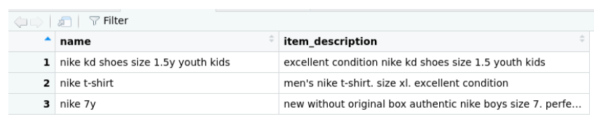
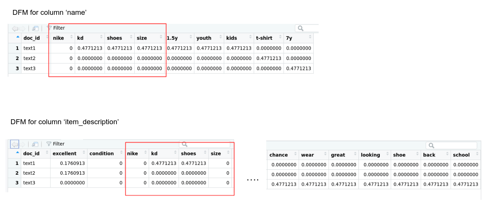
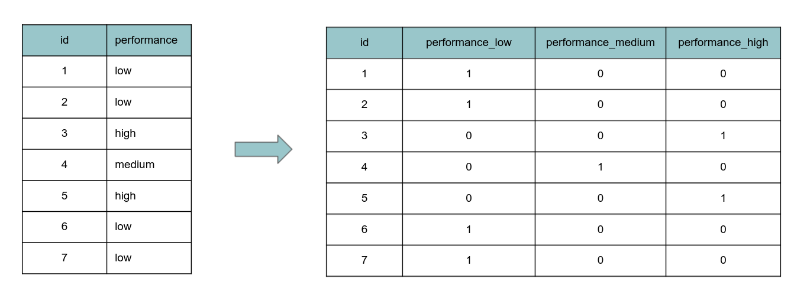
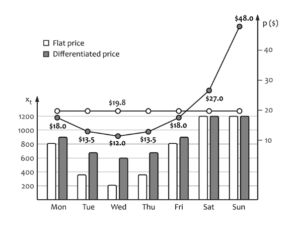

```{r setup, include=FALSE}
# clean up the environment
rm(list = ls())
gc()

# setup chunk options
knitr::opts_chunk$set(
  message = FALSE,
  warning = FALSE,
  fig.align = "center",
  comment = "#>"
)

options(scipen = 9999)
```

The following coursebook is the main part for _Online Data Science Series: Automate Your Price Optimization with Machine Learning_ workshop produced by the team at [**Algoritma**](http://algorit.ma/) . [**Algoritma**](http://algorit.ma/) is a data science education center based in Jakarta. We organize workshops and training programs to help working professionals and students gain mastery in various data science sub-fields: data visualization, machine learning, data modeling, statistical inference, etc.

Before you go ahead and run the codes in this coursebook, it’s often a good idea to go through some initial setup. Under the **Training Objectives** section we’ll outline the syllabus, identify the key objectives and set up expectations for each module. Under the **Libraries and Setup** section you’ll see some code to initialize our workspace and the libraries we’ll be using for the projects. You may want to make sure that the libraries are installed beforehand by referring back to the packages listed here. 

# Introduction

## Training Objectives

The primary objective of this course is to provide a participant a comprehensive introduction about tools for building sentiment analysis model using one of the most popular open-source tools; R. The material will covers:

**Introductory Module: Data Wrangling in R**

* **Tools Introduction**  
  + R and R Studio  
  + Open source packages  
  + Using R Markdown  
  + R Programming Basics  
* **Text mining in R**  
  + Preparing your text data: data cleansing and manipulation
  + Word-tokenizing to identify word’s meaning
  + Working with `quanteda` packages
  
***

**Main Module: Price Optimization with Machine Learning**

* **Mercari Price Suggestion: How to give constant Price Recommendation with Machine Learning**  
  - Working with market place data 
  - Machine Learning workflow for Price Recommendation
  - Metrics Evaluation to measure how good the prediction is

* **Dynamic Price Optimization**
  - Working with Retail Demand data
  - Linear Regression technique for demand estimate
  - Dynamic Price Optimization for multiple time interval
  
## Library and Setup

In this **Library and Setup** section you’ll see some code to initialize our workspace, and the packages we’ll be using for this introductory session of this workshop. 

_Packages_ are collections of R functions, data, and compiled code in a well-defined format. The directory where packages are stored is called the _library_. R comes with a standard set of packages. Others are available for download and installation. Once installed, they have to be loaded into the session to be used. 

You will need to use `install.packages()` to install any packages that are not yet downloaded onto your machine. To install packages, type the command below on your console then press ENTER. 

```{r eval=FALSE}
## DO NOT RUN CHUNK
# packages <- c("tidyverse", "scales")
# 
# install.packages(packages)
```

Then you need to load the package into your workspace using the `library()` function.

```{r libraries}
library(tidyverse)
library(data.table)
library(quanteda)
library(tictoc)
library(Matrix)
library(xgboost)
library(MLmetrics)
library(lubridate)
library(pracma)
```

# Mercari Challenge

[Mercari](https://www.mercari.com/) is Japan’s biggest community-powered shopping website. With the aim of realizing a society where global resources are used carefully and where everyone can live richly, the company has developed a flea market application ‘Mercari’ in Japan and the United States that allows individuals to easily and safely buy and sell goods. Mercari’s challenge is to build an algorithm that automatically suggests the right product prices to sellers on its app.

Predicting the price of a product is a tough challenge since very similar products having minute differences such as different brand names, additional specifications, quality, demand of the product, etc. can have very different prices. For example, one of these sweaters cost `$335` and the other cost `$9.99`. Can you guess which one’s which?

```{r echo=FALSE, out.width="600px", fig.cap="Image source: https://www.kaggle.com/c/mercari-price-suggestion-challenge/overview"}

```

Price prediction gets even more difficult when there is a huge range of products, which is common with most of the online shopping platforms. Mercari’s sellers are allowed to list almost anything on the app. It’s highly challenging to predict the price of almost anything that is listed on online platforms. Lets start to read the data first.

```{r}
data_train <- read_csv("data/mercari/data-train.csv")

glimpse(data_train)
```

The files consist of product listings. Originally the total size of the data is 1.03 GB. But for demo needs we reduce the number of product to 8000 pieces. Both train and test files have the following data fields:

* `name`: the title of the listing. Note that we have cleaned the data to remove text that look like prices (e.g. $20) to avoid leakage. These removed prices are represented as [rm]
* `item_condition_id`: the condition of the items provided by the seller
* `category_name`: category of the listing
* `brand_name`
* `price`: the price that the item was sold for. This is the target variable that you will predict. The unit is USD. This column doesn't exist in test.tsv since that is what you will predict.
* `shipping`: 1 if shipping fee is paid by seller and 0 by buyer
* `item_description`: the full description of the item. Note that we have cleaned the data to remove text that look like prices (e.g. $20) to avoid leakage. These removed prices are represented as [rm]

## Exploratory Data Analysis

```{r}
head(data_train)
```

For the next step, we will do some Exploratory Data Analysis (EDA) which aims to gain insight and improve our understanding of data by looking at a more detailed perspective, based on our business question. The first one we want to deep dive is price variable. How is it distributed? is it any outliers or anomalies? We can utilize the simple function called `summary()` to get statistics information.

```{r}
data_train %>% 
  pull(price) %>% 
  summary()
```
From the result above, some products cost `$0` and the other ones has extreme product prices that are far from the distribution. There seems to be an input error in the data which a price of `$0`. So we will remove the product with these conditions.

```{r}
data_train <- data_train %>% 
  filter(price != 0)
```

## Data Preparation

Next, we will prepare all string data type. If we are dealing or working with string data as a predictor of machine learning model, and we know the 'R case sensitive' characteristic, we need to convert all character to lower case format. So the word _Algoritma_ and _algoritma_ has the same meaning for our program. We can simply use `mutate_if(is.character, tolower)` syntax on our data. 

The *item description* column contains blank and _no decription yet_ which is the same meaning. So lets convert it to a single word `null`.

```{r}
data_train <- data_train %>%
  mutate_if(is.character, tolower) %>%
  mutate(
    item_description = ifelse(
      item_description == "" | item_description == "no description yet",
      "null",
      item_description
    )
  )

head(data_train, 6)
```


### Separate Category Name

Observe that the entries of `category_name` are separated into subcategories by the '/' symbol. How many subcategories are there? we can run following code:

```{r}
temp_text <- "men/tops/t-shirts"

str_count(temp_text, pattern = "/")
```
We use `str_count` function from stringr package to count the number of matches in a string. With the sample text above, we get the result two, which mean the sample consist of three subcategories ('result + 1'). Let's apply to our `category_name` column.

```{r}
data_train %>% 
  pull(category_name) %>% 
  str_count(pattern = "/") %>% 
  unique()
```
The output shows the maximum number of subcategories is five. Also there are entries which no have values which need to convert as 'unknown' in the next step.

We want record each subcategories name as a single column. Then, we prepare new columns names and use `separate()` function to separate a character column into multiple columns with a '/' separator. zTo make it clear how the function works, we will use sample data and only focus on 'category_name'. 

```{r}
subcat <- c('cat_1', 'cat_2', 'cat_3', 'cat_4',  'cat_5')

temp_category <- data_train %>% 
  select(name, category_name) %>% 
  separate(col = category_name, into = subcat, sep = "/", remove = FALSE)

tail(temp_category)
```
Then, lest apply to the original data.


```{r}
data_train <- data_train %>% 
  separate(col = category_name, into = subcat, sep = "/")
```

Next, we will replace empty entries in data with 'unknown' character. Supposedly, if we check again with `anyNA()` function, there are no more NA data. Also, for the sake of decreasing computation cost, we will convert some of categorical columns to factor type.

```{r}
data_train <- data_train %>% 
  replace(is.na(.), "unknown") %>% 
  mutate(brand_name = ifelse(brand_name == "", "unknwon", brand_name)) %>% 
  mutate_at(.vars = c("item_condition_id", "brand_name", "shipping", subcat), as.factor)

anyNA(data_train)
```
We can compile all data preparation above as a reproducible function. If any new data input, we no need to execute line by line with the same command, but simply apply the function we created. We'll apply this function to test dataset later.

```{r}
data_prep <- function(data){
  data_clean <- data %>%
    filter(price != 0) %>%
    mutate_if(is.character, tolower) %>%
    mutate(
      item_description = ifelse(
        item_description == "" | item_description == "no description yet",
        "null",
        item_description
      )
    ) %>%
    separate(col = category_name, into = subcat, sep = "/") %>%
    replace(is.na(.), "unknown") %>%
    mutate(brand_name = ifelse(brand_name == "", "unknwon", brand_name)) %>%
    mutate_at(.vars = c("item_condition_id", "brand_name", "shipping", subcat),
              as.factor)
  
  return(data_clean)
}
```

### Document Feature Matrix

Our task is to predict product price from all information entered by the merchant included item description, name, and category. To do so, we mine features from those textual data and fit to a machine learning model. Following are some approach to make our program understand every single words that entries to the system:

1. Document Feature Matrix
2. One Hot Encoding
3. Data Sparse Matrix

Document Feature Matrix or familiar called as Document Term Matrix is an important representation for text analysis. Each row of the matrix is a document vector which is our each product, and the column represent every term in the entire dictionary.

Some documents may not contain certain terms, so these matrix are sparse. The value in each cell of the matrix is the **frequency term**. This value is often a weighted term frequency, typically using **Term Frequency-Inverse Document Frequency** (TF-IDF)

**Why TFIDF?**

Term Frequency approach to determine the weight of each term in a document based on the number of occurrences in the document. The greater the number of occurrences (high TF), the greater its weight in the document. But, there are not important words that appear several time in the document which can be biased during modelling.

So Inverse Document Frequency approach come up to solve that problem. Inverse Document Frequency (IDF) to reduce the dominance of words that often appear in various documents. This step is necessary because words that appear a lot in various document can be considered as general terms so the value will set to 'not important'. TF-IDF to measure how important a word is in the corpus.

```{r}
build_dfm <- function(x, n = 1) {
  
  mat <- dfm(
    x,
    tolower = TRUE,
    remove_punct = TRUE,
    remove_symbols = TRUE,
    remove_numbers = TRUE,
    remove = stopwords("english"),
    ngrams = n
  )

  mat <- dfm_tfidf(mat)
  
  return(mat)
  
}
```

After we do Document Feature Matrix for column `name` and `item_description`, we combine them into one data matrix. So imagine if the `nike` column contains the word 'nike' and the `item_description` column also contains the word 'nike', the result may be misleading. For instance, please look the sample below:

```{r echo=FALSE, out.width="600px", fig.cap="Original sample data"}

```

```{r echo=FALSE, out.width="800px", fig.cap="DFM result"}

```

It's too difficult for our machine to understand the word 'nike' which is the product name, and the word 'nike' as a item description. So the solution is to paste the context of each column to the rest of the features, to define a new colnames more unique. 

```{r}
tic()
dfm_item_description <- build_dfm(x = data_train$item_description)
dfm_item_description@Dimnames[[2]] <- paste0("desc_", dfm_item_description@Dimnames[[2]])
toc()

tic()
dfm_name <- build_dfm(x = data_train$name)
dfm_name@Dimnames[[2]] <- paste0("name_", dfm_name@Dimnames[[2]])
toc()
```

### One-hot Encoding

Categorical data refers to variables that are made up of label values, for example, a “performance level” variable could have the values “low“, “medium, and “high”. One-hot encoding is a scheme of vectorization where each category in a categorical variable is converted into a vector of length equal to the number of data points. The vector contains a value of 1 against each data point that belongs to the category corresponding to the vector and contains 0 otherwise. To make it clearer, look at the following example.

```{r echo=FALSE, out.width="600px", fig.cap="One-hot encoding concept"}

```

We will converted all the categorical variables (item_condition, shipping, brand_name, cat_1, ..., cat_5) to their one-hot encoded vectors. Example code is shown below:

```{r}
temp <- sparse.model.matrix(~ brand_name + cat_1 + cat_2 + cat_3 + cat_4 + cat_5, 
                            data = data_train[1:10, c("item_condition_id", "brand_name", "shipping", subcat)])

temp %>% 
  as.matrix() %>% 
  as.data.frame() %>% 
  head()
```

Since we know our data will probably have a lot of zero values, so we will use the sparse matrix to store the data we have processed. A sparse matrix is a matrix that is comprised of mostly zero values. 

> A matrix is sparse if many of its coefficients are zero. The interest in sparsity arises because its exploitation can lead to enormous computational savings and because many large matrix problems that occur in practice are sparse.

Often you may deal with large matrices that are sparse with a few non-zero elements. In such scenarios, keeping the data in full dense matrix and working with it is not efficient. 

A better way to deal with such sparse matrices is to use the special data structures that allows to store the sparse data efficiently. In R, the `matrix` package offers great solutions to deal with large sparse matrices.

Let's see comparison between dense matrix and sparse matrix in term of the size. Let us create a dummy data and randomly select the indices and make them to contain zeroes.

```{r}
data <- rnorm(1e6)
zero_index <- sample(1e6)[1:9e5]
data[zero_index] <- 0
```

Now we have created a vector of million elements, but 90% of the elements are zeros. Let us make it into a dense matrix.

```{r}
mat <- matrix(data, ncol=1000)
mat[1:5,1:5]
```
We can use R function object.size and check the size of the dense matrix.

```{r}
print(object.size(mat),units="auto")
```
Let us use sparse matrix library to convert the dense matrix to sparse matrix. We can see that elements with no values are shown as dots.

```{r}
mat_sparse <- Matrix(mat, sparse = TRUE)
mat_sparse[1:5, 1:5]
```

It tells us that our sparse matrix belongs to a class “dgCMatrix”. The sparse matrix type “dgCMatrix” refers to double sparse matrix stored in CSC, Compressed Sparse Column format. A sparse matrix in CSC format is column-oriented format and it is implemented such that the non-zero elements in the columns are sorted into increasing row order. Let us check the size of our sparse matrix.

```{r}
print(object.size(mat_sparse),units="auto")
```
The sparse matrix stores the same data in just about 1 Mb, way more memory efficient than the dense matrix. About seven times smaller than the dense matrix. So lets apply in our data train:

```{r}
tic()
one_hot_train <- sparse.model.matrix(
    ~ item_condition_id + shipping + brand_name +
    cat_1 + cat_2 + cat_3 + cat_4 + cat_5,
    data = data_train[c("item_condition_id", "brand_name", "shipping", subcat)])
toc()
```

Next, we will change object type of `dfm_item_description` and `dfm_name` as a dgCMatrix then combine them as one data that ready for modelling.

```{r}
class(dfm_item_description) <- class(one_hot_train)
class(dfm_name) <- class(one_hot_train)

tic()
data_train_sparse <- cbind(
        one_hot_train, 
        dfm_item_description,
        dfm_name)

rownames(data_train_sparse) <- NULL
toc()
```

## Modelling with XGBoost

XGBoost was formulated by Tianqi Chen which started as a research project a part of The _Distributed Deep Machine Leaning Community (DMLC)_ group. XGBoost is one of popular algorithm because it has been the winning algorithm in a number of recent Kaggle competitions. XGBoost is a specific implementation of the Gradient Boosting Model which uses more accurate approximations to find the best tree model. XGBoost specifically used a more regularized model formalization to control overfitting, which gives it better perfomance.

### Concept

Xgboost works through the system optimization:

```{r echo=FALSE, out.width="600px"}
knitr::include_graphics("img/xgboost.png")
```

**1. Parallelized tree building**

XGBoost approaches the process of sequential tree building using parallelized implementation.

**2. Tree pruning**

Unlike GBM, where tree pruning stops once a negative loss is encountered, XGBoost grows the tree up to `max_depth` and then prune backward until the improvement in loss function is below a threshold.

**3. Cache awareness and out of core computing**

XGBoost has been designed to efficiently reduce computing time and allocate an optimal usage of memory resources. This is accomplished by cache awareness by allocating internal buffers in each thread to store gradient statistics. Further enhancements such as ‘out-of-core’ computing optimize available disk space while handling big data-frames that do not fit into memory.

**4. Regularization**

The biggest advantage of XGBoost is regularization. Regularization is a technique used to avoid overfitting in linear and tree based models which limits, regulates or shrink the estimated coefficient towards zero.

**5. Handles missing value**

This algorithm has important features of handling missing values by learns the best direction for missing values. The missing values are treated them to combine a sparsity-aware split finding algorithm to handle different types of sparsity patterns in data.

**6. Built-in cross validation**

The algorithm comes with built in cross validation method at each iteration, taking away the need to explicitly program this search and to specify the exact number of boosting iterations required in a single run.

### Parameter

There is no benchmark to define the ideal parameters because it will depend on your data and specific problem. XGBoost parameters can defined into three categories:

For more detail parameter, the full list of possible parameters is available on the documentation [XGBoost Parameters](https://xgboost.readthedocs.io/en/latest/parameter.html)

#### General 

Controls the booster type in the model which eventually drives overall functioning.

1. `booster`

For regression problems, we can use `gbtree` and `gblinear`. In `gblinear`, it builds a generalized linear model and optimizes it using regularization and gradient descent. The next model will built on residuals generated by previous iterations.

2. `nthread`

To enable parallel computing. The default is the maximum number of threads available.

3. `verbosity` (logging)

Verbosity to display warning messages. The default value is 1 (warning), 0 for silent, 2 for info, and 3 for debug.

#### Boosting Parameter

Controls the performance of the selected booster

1. `eta` (alias learning_rate)

The range of eta is 0 to 1 and default value is 0.3. It controls the maximum number of iterations, the lower eta will generate the slower computation.

2. `gamma` (alias min_split_loss)

The range of gamma is 0 to infinite and default value is 0 (no regularization). The higher gamma is the higher regularization, regularization means penalizing large coefficients that don't improve the model's performance.

3. `max_depth`

Maximum depth of a tree. The range of max_depth is 0 to infinite and default value is 6, increasing this value will make the model more complex and more likely to overfit.

4. `min_child_weight`

The range of min_child_weight is 0 to infinite and default value is 1. If the leaf node has a minimum sum of instance weight lower than min_child_weight in the tree partition step than the process of splitting the tree will stop growing.

5. `subsample`

The range of subsample is 0 to 1 and default value is 1. It controls the number of ratio observations to a tree. If the value is set to 0.5 means that XGboost would randomly sample half of the training data prior to growing trees and this will prevent overfitting. subsample will occur once in every boosting iteration.

6. `colsample_bytree`

The range of colsample_bytree is 0 to 1 and default value is 1. It controls the subsample ratio of columns when constructing each tree.

### Learning Task Parameter

Sets and evaluates the learning process of booster from the given data.

1. objective

* `reg:squarederror` for regression with squared loss
* `binary:logistic` for binary classification, output probability

2. eval_metric

Evaluation metrics for validation data, a default metric will be assigned according to objective:

* rmse for regression
* logloss for classification

### Modelling

```{r}
data_train_xgb <- xgb.DMatrix(data = data_train_sparse, label = data_train$price)
```

Let's build a model and implement a few parameters that can affect our model's performance and training speed.

```{r}
tic()
model <- xgboost(data = data_train_xgb, nround = 500, objective = "reg:squarederror", verbose = FALSE)
toc()
```
```{r}
model$evaluation_log %>% 
  ggplot(aes(x = iter, y = train_rmse)) +
  geom_line() +
  labs(title = "Model evaluation log",
       y = "RMSE data train",
       x = "Iteration") 
  
```
From the graph above, can we say that the curve is not yet fully convergent? if yes, then that's a good sign our model can still be improved by increasing the number of iterations. for those of you who are curious, you can do it by yourself, because it is quite time consuming.

### Model Evaluation

```{r}
pred_train <- predict(model, data_train_sparse)
```

```{r}
result_train <- data_train %>% 
  select(actual = price) %>% 
  mutate(prediction = pred_train)

result_train %>% 
  sample_n(10)
```

- **Mean Absolute Error**

There are many ways of measuring a model’s accuracy. However, the Mean Absolute Error, also known as MAE, is one of the many metrics for summarizing and assessing the quality of a machine learning model, especially for regression task. In MAE the error is calculated as an average of absolute differences between the target values and the predictions. 

$$MAE = \frac{1}{n}\sum_{t=1}^{n}|e_t|$$


- **Root Mean Squared Error**

RMSE is a quadratic scoring rule that also measures the average magnitude of the error. It’s the square root of the average of squared differences between prediction and actual observation.

$$RMSE = \sqrt{\frac{1}{n}\sum_{t=1}^{n}e_t^2}$$


- **Mean Absolute Percentage Error**

MAPE measures the accuracy as a percentage, and can be calculated as the average absolute percent error for each time period minus actual values divided by actual values. 

$$MAPE = \frac{100\%}{n}\sum_{t=1}^{n}\left |\frac{e_t}{y_t}\right|$$

```{r}
rmse_train <- RMSE(y_pred = result_train$prediction, y_true = result_train$actual)
rmse_train
```
```{r}
result_train %>%
  sample_n(150) %>%
  mutate(no = 1:150) %>%
  pivot_longer(cols = c(actual, prediction),
               names_to = "label") %>%
  ggplot(aes(y = value)) +
  geom_line(aes(x = no,
                col = label)) +
  scale_color_manual(values = c("firebrick", "dodgerblue")) +
  labs(x = "Row indices",
       y = "Product price",
       title = "Comparasion actual vs prediction price",
       subtitle = "Sample of data train",
       caption = paste("RMSE:", round(rmse_train, 2))) +
  theme(legend.position = "bottom")
```

### Predict on Test Data

After develop model machine learning on train data set, what is the next step? 

- Pick a final model based on an evaluation criteria (the best accurate model)  
- Obtain an unbiased measurement of the model's accuracy by predicting on test set data

The idea of obtaining an unbiased estimate of our model's out-of-sample performance is an important one as it is often the case that the in-sample error (the error you obtain from running your algorithm on the dataset it was trained on) is optimistic and tuned / adapted in a particular way to minimize the error in the training sample.

Therefore - the in-sample error is not a good representation or indication of how our model will perform when it is applied on unseen data. 

Another way to think about is that our training data has two components to it: signal and noise. The goal of machine learning is to identify the signal but be robust enough to avoid modeling the **noise** component of the data. 

When we build a model, we want to know that our model is not overly adapted to the data set to the point that it captures both the signal and noise, a phenomenon known as **"overfitting"**.  When our model is guilty of overfitting, the in-sample accuracy will be very high (in some cases ~100%) but fail to perform on unseen data. **The idea is to strike the right balance between accuracy (don't underfit) and robustness to noise (don't overfit).**  

#### Data Preparation

Let's us import and do some data pre-processing like we did before in training dataset.

```{r}
data_test <- read_csv("data/mercari/data-test.csv") 

glimpse(data_test)
```
Recall, previously we made a custom function to prepare our unseen data. So, its time we use it on test data set. its look very straightforward, we just simply call the function and set the desired data.

```{r}
data_test <- data_prep(data = data_test)

head(data_test)
```
#### Document Feature Matrix

Here are the same things like we did on training set data. Build a document feature matrix on unseen data. However, there are some adjustments later regarding to the dictionary/corpus. Right now, take your time to remembering the meaning of each command we used.

```{r}
tic()
dfm_item_description_test <- build_dfm(x = data_test$item_description)
dfm_item_description_test@Dimnames[[2]] <- paste0("desc_", dfm_item_description_test@Dimnames[[2]])
toc()

tic()
dfm_name_test <- build_dfm(x = data_test$name)
dfm_name_test@Dimnames[[2]] <- paste0("name_", dfm_name_test@Dimnames[[2]])
toc()
```

```{r}
tic()
data_test_sparse <- sparse.model.matrix(
    ~ item_condition_id + shipping +
    cat_1 + cat_2 + cat_3 + cat_4 + cat_5,
    data = data_test[c("item_condition_id", "brand_name", "shipping", subcat)]
)
toc()

class(dfm_item_description_test) <- class(data_test_sparse)
class(dfm_name_test) <- class(data_test_sparse)
```
Combine data one-hot encoding, sparse matrix item description, and sparse matrix name product of our test data set.
```{r}
tic()
data_test_sparse <- cbind(
        data_test_sparse, 
        dfm_item_description_test,
        dfm_name_test)
toc()
```
#### Features Matching

Classic problem when dealing with text data predictors is, thare are words that do not appear in new data (test data set). So the dimension between training set and testing set data is different. if we force the model to predict the data, obviously it will error. 

```{r}
data_train_sparse@Dim
data_test_sparse@Dim
```
Look, total training data columns is 22756 while the test data only 9035. Of course, we need to equate the features of training set and testing set data. First we need to check, which training data columns is not in the test data? following are the commands we used.

```{r}
select_empty <- data_train_sparse@Dimnames[[2]][!(data_train_sparse@Dimnames[[2]] %in% data_test_sparse@Dimnames[[2]])]
```

Then, we generate a new sparse matrix from the result above. Replace all missing value with 0, because in fact the test data does not contain some of these features. 

```{r}
tic()
data_test_empty <- setNames(data.frame(matrix(ncol = length(select_empty), nrow = nrow(data_test))), select_empty) %>% 
  replace(is.na(.), 0) %>% 
  as.matrix() %>% 
  as("sparseMatrix")
toc()
```

Lets combine the data and check the dimension again.

```{r}
data_test_sparse <- cbind(
  data_test_sparse,
  data_test_empty
)

data_test_sparse@Dim
```
We can see that the column size is same with training data. Not finished yet, we need to match the order of test data columns as in the training set data. Why? this due to the functional requirements of the XGBoost model object it need the same order of columns as learned. Of course this will take quite a while to process.

```{r}
df_test_complete <- data_test_sparse %>% 
  as.matrix() %>% 
  as.data.frame()

data_test_sparse <- df_test_complete[,data_train_sparse@Dimnames[[2]]] %>% 
    as.matrix() %>% 
    as("sparseMatrix")

rownames(data_test_sparse) <- NULL
```

Do not forget to convert as `xgb DMatrix`. 

```{r}
data_test_xgb <- xgb.DMatrix(data_test_sparse)
```

#### Model Evaluation Data Test

We have finished preparing new data. Now, we can move to prediction step and evaluation model. Let’s use the generic `predict()` function to predict with the model we’ve constructed, on the test set data to get a sense of it’s performance on unseen data:

```{r}
pred_test <- predict(model, data_test_xgb)
```

```{r}
result_test <- data_test %>% 
  select(actual = price) %>% 
  mutate(prediction = pred_test)

result_test
```

```{r}
rmse_test <- RMSE(y_pred = result_test$prediction, y_true = result_test$actual)
rmse_test
```

```{r}
result_test %>%
  sample_n(150) %>%
  mutate(no = 1:150) %>%
  pivot_longer(cols = c(actual, prediction), names_to = "label") %>%
  ggplot(aes(y = value)) +
  geom_line(aes(x = no,
                col = label)) +
  scale_color_manual(values = c("firebrick", "dodgerblue")) +
  labs(
    x = "Row indices",
    y = "Product price",
    title = "Comparasion actual vs prediction price",
    subtitle = "Sample of data test",
    caption = paste("RMSE:", round(rmse_test, 2))
  ) +
  theme(legend.position = "bottom")
```
A 13.79 RMSE on unseen data! it seems the model is good enough to predict prices on the new data. 

# Price Optimization

A demand model enables us to search for the optimal price by analyzing how the price changes increase or decrease the profits. In practice, however, we face numerous constraints and interdependencies that require much more elaborate and specialized optimization models to be developed. From [AI for Marketing Operation] Book, most of the constraints fall into one of the following three categories: **supply constraints, demand constraints, and structural constraints**.

* Supply constraints can be imposed by limited resource capacity, such as the fixed number of seats in an Airlines or Cinema. 
* Demand constraints are often related to imperfect consumer segmentation, interdependency of the demands on substitutable products, demand changes over time, and demand uncertainty, in the sense that the demand cannot be predicted accurately. 
* Structural constraints are related to operational and legal conditions that might require suboptimal but practicable solutions to be selected.

We will discuss those constraints later, but for now let's begin for the simple one example.

## Constant Price optimization

In this case, we are going to use demand models to find the optimal prices recommendation. Here is the synthetic data we generate for academic purpose. The data is regarding the sales of shoes from a factory located in Bandung. Each row represents the price and total shoes sold at time-t, where aggregated from weekly transactions. Let's read and glimpse the data.

```{r}
shoes <- read_csv(file = "data/shoes.csv")
glimpse(shoes)
```
### Demand Function

Since we are going to use demand function to find the optimum price, we need to know common type of demand model called linear model. The demand is given by:

$$d(p) = \alpha + \beta$$
where $\alph$ is a slope of the curve and $\beta$ is the intercept. In general setting, the total profit function can defined as:

$$L(p) = d(p)(p-c)$$
where, $L$ gives the profit, $d$ is demand function that depends of the price and $c$ is the *marginal cost*. From mathematical-wise, if we want to optimize the function, find the local/global minimum or local/global maximum, we can use the partial derivative technique. For you who want to deep dive this concept, please lookup to [this articel](https://www.whitman.edu/mathematics/calculus_online/section06.01.html). So, taaking the derivative with respect to price we have:

$$L'(p) = d'(p)(p-c) + d(p)$$
making $L'(p) = 0$ to calculate the optimum price (first order condition), we have: 

$$d'(p^*)(p^*-c)+d(p^*) = 0 \\ d'(p^*)p^*+d(P^*) - d'(p^*)c$$

Since  $d'(p) = \alpha$ the formula be like:

$$d'(p^*)p+d(p^*) = d'(p^*)c, \\ \alpha p^* + \alpha p^* + \beta = \alpha c, \\ p^* = \frac{\alpha c - \beta}{2 \alpha}.$$

### Fit a demand model

let’s see how to calculate the optimum prices for this demand functions. Assumed that the *marginal cost* is $50. So we create an object called `mc` with value 50. For the demo purpose, we will only use Semarang region. So lets first subset the data.

```{r}
mc <- 50

shoes_filter <- shoes %>% 
  filter(region == "Semarang")
```

Next, we create a new column `profit` which is the calculation of profit with the formula we discussed earlier.

```{r}
shoes_agg <- shoes_filter %>% 
  mutate(profit = quantity*(price-mc))
```

Create a linear model in R is as convenient as you’d wish it to be. We will call the `lm()` function and specify two parameters: the `formula` for our linear model and the `data` from which our model is built from. Notice that we will saved model_lm as a linear model and we can now use the attributes of model_lm, such as its $coefficients to create our price optimization later.

```{r}
# Fit of the demand model

model_lm <- lm(quantity~price, shoes_agg)
summary(model_lm)
```
From the output of the `summary()` call, we see the two coefficients that represent our *model line*. The point at which our line crosses the y-intercept is 13726.073 ($\alpha$) and the slope ($\beta$) is -90.679. 

```{r}
# extract slope and intercept from the model.

alpha <- model_lm$coefficients[2]
beta <-  model_lm$coefficients[1]
```

### Find Optimal Price


Next, we will create a new column called `profit_fitted` to *estimate the profit* from the `model_lm`. The idea is to compare the actual profit, and the estimated profit derived from the model.

```{r}
shoes_agg <- shoes_agg %>% 
  mutate(profit_fitted = model_lm$fitted.values*(price - mc))
```

Then, we are going to find the optimal price. So we need to substitute. the `alpha` and `beta` values that we obtained before, with the derivative formula of profit. 

```{r}
# Optimal Price

price_max_profit <- (alpha*mc - beta)/(2*alpha)

profit_max <- predict(model_lm, newdata = data.frame(price = price_max_profit))*(price_max_profit - mc)
```

To convince you, here is the graphic result.

```{r}
# Plots

ggplot(shoes_agg) + aes(x = price, y = profit) +
  geom_point() + 
  geom_vline(xintercept = price_max_profit, lty = 2) +
  geom_hline(yintercept = profit_max, lty = 2) +
  geom_line(aes(x = price, y = profit_fitted), color = 'red') +
  annotate(geom = "label", x = price_max_profit, y = profit_max+(profit_max*0.15), label = paste("Optimal Price at $", round(price_max_profit,2)))
```

From result above, the right price to optimize the profit is about $ 100.68. This look make sense, because from the historical data and graphic, if we shift the price value to the right (which mean increasing value), there will possibility that customer are reluctant to buy the produt so the profit decreases.

**Dive Deeper:** it's your turn to try to find optimal prices for other regions. Please create a new chunk below and you can follow the previous step.

```{r}
# your solution here

```


## Dynamic Price with time interval

Price Differentiation:

* Differentiation with demand shifting

The shifting effect is especially important in cases of constrained supply because it can help to achieve a more even demand distribution and reduce stockout. For example, the supply of seats in a Cinema is fixed but the demand can vary significantly, typically reaching its maximum on the weekend and its minimum on weekdays. The Cinema can lose potential revenue if the peak demand on the weekends exceeds the capacity. We can expect that setting variable ticket prices for different days of the week can improve profits because the higher demand on the weekends enables the Cinema to charge higher prices and make better margins, please look at following graphic:

```{r echo=FALSE, out.width="800px", fig.cap="Example of ticket price optimization for a Cinema. The vertical bars represent the number of seats sold, and the points are the ticket prices for the corresponding days."}

```

* Differentiation with constrained supply

The previous method for price optimization we have considered a demand function to setting prices that maybe the optimal possible profit. Those assumption is reasonably fair, for some industries, like supermarket, where stockouts are rare. However, it does not hold in many other industries that face different supply constraints. In this section, we will discuss a relatively simple case, in which each market segment has a fixed capacity of a product and we need to find the optimal global price or segment-level prices

### Introduction Linear Programming

We will use method called *linear programming* to optimize the objective function. Here is a brief explanation about linear programming. Linear Programming is basically a subset of optimization. Linear programming or linear optimization is an optimization technique wherein we try to find an optimal value for a linear objective function for a system of linear constraints using a varying set of decision variables. Its also known as sensitivity analysis. There are two important things:

* sensitivity of the optimal solution to changes in the available resources, i.e., the right hand side (RHS) of the constraint
* sensitivity of the optimal solution to the changes in unit profit or unit cost, i.e., coefficient of the objective function.

Case study:

A retailer is going to divide their 50 factory between two groups. Production cost for group A is `$10` per factory. Production cost for group B is `$20` per factory. The retailer can spend at most `$700` on production seed. If group B brings in a profit of `$150` per factory and group A brings a profit of `140` per factory, how many factories should the retailer push to maximize their profit?

Lets create an objective function:

$$P = 140a + 150b$$
where a is the number of factories of group A, and b is vice versa. 

Constraints:

$$a + b \leqslant 50 \\ 10a + 20b \leqslant 70 \\ a \geqslant 0 \\ b \geqslant 0 $$
### Convert objective function to R code

lets convert to R code:

```{r}

# setup objective function and constraints

obj_func <- c(140, 150)
constrain1 <- matrix(c(1,1,10,20), nrow = 2, byrow = T)
rhs1 <- c(50,700)

# linear programming

linprog(cc = obj_func, Aeq  = constrain1, beq =rhs1)
```
The maximum z value (and thus, the optimum) that can be obtained while satisfying the given constraints is 7200, where x1 = 30 and x2 = 20. So the maximum profit is 7200 when the retailer push 30 factory of group A and 20 factory of group B.

### Case study

After you understand the basic concept is, lets go through the main topic, with `shoes` dataset. If the shoes retailer want to plans a four week sale campaign for a single product. We need to prepare the data first to get weekly demand vs pricing.

```{r}
data_agg <- shoes_filter %>% 
  mutate(week = ceiling(day(date) / 7)) %>% 
  filter(week != 5) %>% 
  select(week, price, quantity)

data_agg %>% 
  ggplot(aes(x = price, y = quantity)) +
  geom_point() +
  geom_smooth() +
  facet_wrap(facets = vars(week))
```
to get the *demand function*, we need to create a linear model model for each week group. Lets do it and look the intercept and slope value.

```{r}
fitted_models <- data_agg %>% 
  group_by(week) %>% 
  do(model = lm(quantity ~ price, data = .))

fitted_models$model[[1]] # model for first week
```

```{r}

# allowed price levels

price_list <- c(39, 59, 79, 99, 129, 149)

# t number of time intervals you want to recommend

t <- 4

# subtitute all price value to demand function

demand_w1 <- 12497.97 - 76.43*price_list
demand_w2 <- 15365.4 - 106.5*price_list
demand_w3 <- 13213.18 - 88.44*price_list
demand_w4 <- 14363.2 - 98.1*price_list


demand_vec <- c(demand_w1, demand_w2, demand_w3, demand_w4)
demand_vec <- ifelse(demand_vec < 0, 0, demand_vec)
demand_mat <- matrix(demand_vec, nrow = 1, byrow = TRUE)

cat("demand matrix: \n \n")
demand_mat

# Evaluate revenue for each demand function and each price level

revenue_vec <- demand_vec*price_list


cat("revenue vector: \n \n")

revenue_vec
```
Now we solve the following optimization problem: [Introduction to Algorithmic Marketing: AI for Marketing Operation](https://www.amazon.com/Introduction-Algorithmic-Marketing-Artificial-Intelligence/dp/0692989048)


$$\displaystyle \max_{z} \ \sum_{t=1}^{T}\sum_{i=1}^{K} z_{it} \ . \ P_i \ . \ q(p_i,t) \\ 
subject \ to \sum_{t=1}^{T}\sum_{i=1}^{K} z_{it} \ . \ q(P_i,t) \le C \\ 
\sum_{i=1}^{K} z_{it} = 1, \ for \ t = 1,...,T \\
z_{it} \ge 0$$

where q is demand, P is price, T is the number of time periods, and K is the number of price levels. Next we create the constraints formulas:

* First we generate a binary mask to ensure all Z's in one time interval sum up to 1. 
* Second, we ensure that the sum of all demands is less than the available stock level, that is $z_{it} \ . \ q(P_i,t) \le C$.

```{r}
# constraint --------------------------------------------------------

create_mat <- function(i, k) {
  
  # create zero matrix
  
  mat_array <- matrix(data = 0,
                      ncol = i * k,
                      nrow = i)
  
  # filling values for each row
  
  for (row_mat in 1:i) {
    mat_array[row_mat, (row_mat * k):(row_mat * k - (k - 1))] <- 1
  }
  return(mat_array)
  
}

constrain_1 <- create_mat(i = t, k = length(price_list))

constrain_2 <- rep(1, t)

```

Then, we do the linear program, and put all the value into the argument. Do not forget to determined the `b` argument, which is product capacity.

```{r}

# linear program

set.seed(9999)

result <- linprog(cc = revenue_vec,  A = demand_mat, b = 10000, Aeq = constrain_1, beq = constrain_2, maximize = T)

cat(paste("Total Revenue: $", round(result$fva, 2)))

cat("Price schedule: \n")

matrix(result$x, nrow = length(price_list), ncol = t, byrow = F) 
```

Each column of the solution matrix corresponds to a time period (one week). Each row corresponds to z value that can be interpreted as the percentage of time z't price level should be used in the corresponding time period. We can interpret, the optimal price is `$129` for the first, third, and fourth weeks when the capacity product is 10,000 items. For the same capacity, the price is fractional for the second week, which means a mix with 69% at `$99` and 31% at `$129`. 

with 10000 product stock available, we can determine the schedule price as follows:

1. The first week sell 2838 stocks at a price of `$129`, the estimated revenue earned was around `$340,366.50`
2. The second week sell 3353 stocks at `$99`, and 495 at `$129`, the estimated revenue earned was around `$331,973.28` + `$63,921.37` or around `$389,594`
3. The third week sell 1804 stocks at a price of `$129`, estimated revenue `$232,770.18`
4. Fourth week sell 1708 stocks at price `$129`, estimated revenue `$220,370.70`

So the total revenue which company will earn if all product are sold is approx `$1,189,402.04`

**Dive Deeper**:

Let us now consider an example of a retailer who plans a four-week sale campaign for a single product. The set of allowed prices includes five levels: `$89, $79, $69, $59, and $49`. Demand functions are estimated for each week of the sale as follows:

week 1: 1500 - 10p
week 2: 1300 - 15p 
week 3: 1200 - 15p
week 4: 1100 - 18p

1. Find the optimal price for each week if the product capacity is 1300.
2. What is the estimated revenue obtained if you use the price combination above?

----